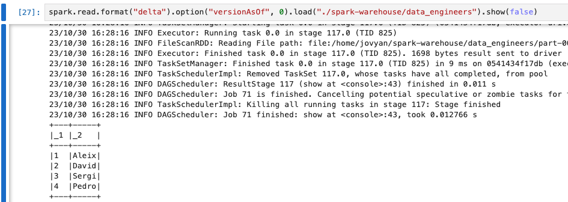

# Delta lake format introduction

---

# Disclaimer (I)
Most of the code is based on jupyter notebooks using the spylon kernel (scala), but there may be some .dbc files

---

# Disclaimer (II)

You can enable delta on your local spark by download the jar and enabling the extensions.

```sh
bin/spark-shell --packages io.delta:delta-spark_2.12:3.0.0 
--conf "spark.sql.extensions=io.delta.sql.DeltaSparkSessionExtension" 
--conf "spark.sql.catalog.spark_catalog=org.apache.spark.sql.delta.catalog.DeltaCatalog"
```

--- 

# Disclaimer (III)

https://docs.delta.io/latest/delta-standalone.html

---

# Disclaimer (IV)

There is a docker-compose file in the project granting you access to a jupyter notebook with delta


---
### What is Delta Lake?
It was a project launched by [Databricks in 2017](https://www.databricks.com/company/newsroom/press-releases/databricks-launches-delta-combine-best-data-lakes-data-warehouses-streaming-systems) for merging the data warehouse and the datalake and it become managed by the Linux Foundation in 2019.

---
### Advantages?

* ACID transactions on file formats
* Efficient data layout
* Rename, reorder columns in a table
* Metadata scale
* Time travel to older versions of the table
* Enable change data feed aka change data capture

https://www.vldb.org/pvldb/vol13/p3411-armbrust.pdf

---

### How does it work?
It is based on parquet files containing the actual data + json files describing a protocol.

---

### Demo time

---

### From Parquet to Delta

```scala
import io.delta.tables._

DeltaTable.convertToDelta(spark, "parquet.`sample_data/user_data`")
```


--- 

### Delta from a dataframe

```scala
val sampleData = Seq(
    (1,"Pedro"),
    (2,"Sergi"),
    (3,"Aleix"),
    (4,"David")
)

import spark.implicits._
val df = sampleData.toDF()
df.coalesce(1).write.mode("overwrite").format("delta").saveAsTable("data_engineers")
```
---
### Table directory

```
spark-warehouse/data_engineers/
|->delta_log/
|           |->00000000000000000000.json
|->part-00000-1642cfd8-1dfa-497a-8c3f-2e000c2b1d79-c000.snappy.parquet
```

---

### Delta Log (I)

```json
{
    "commitInfo": {
        "timestamp": 1698680849935,
        "operation": "CREATE OR REPLACE TABLE AS SELECT",..
    }
{
        "protocol": {
            "minReaderVersion": 1,
            "minWriterVersion": 2
        }
    }
{
        "metaData": {
            "id": "ab71b946-f933-4dff-a11f-e7c6ecf70264",
            "format": {
                "provider": "parquet",
                "options": {}
            },
            "partitionColumns": [],
            "configuration": {},
            "createdTime": 1698680849740
        }
    }
```

---

## Delta Log (II)

```json
{
    "add": {
        "path": "part-00000-1642cfd8-1dfa-497a-8c3f-2e000c2b1d79-c000.snappy.parquet",
        "partitionValues": {},
        "size": 714,
        "modificationTime": 1698680849845,
        "dataChange": true,
        "stats": "{\"numRecords\":4,\"minValues\":{\"_1\":1,\"_2\":\"Aleix\"},\"maxValues\":{\"_1\":4,\"_2\":\"Sergi\"},\"nullCount\":{\"_1\":0,\"_2\":0}}"
    }
}
```

---

### Merging data (I)

```scala
import io.delta.tables._

val newDataDf = Seq(
    (4,"Adrian"),
    (5,"David"),
    (6,"Simon")
).toDF()

DeltaTable
.forName("data_engineers")
.as("oldData").merge(newDataDf.as("newData"),"oldData._1 = newData._1")
  .whenMatched(some condition)
  .updateAll
  .whenNotMatched
  .insertAll
  .execute()
```
---

### How does it get atomicity for a merge?

1. Find files in the table that match join condition
2. Read those files and write them again with updates and / or inserted rows
3. Add a new entry in the protocol removing the touched files and  adding the new ones

---

### Merging data (II)


---

### Merge data (III)

insertOnly -> leftAntiJoin (left join where right is null)
updateOnly -> rightJoin
insert, update and delete -> fullOuterJoin

---

### Merging data (III)

```
spark-warehouse/data_engineers/
|->delta_log/
|           |->00000000000000000000.json
|           |->00000000000000000000.json.crc
|           |->00000000000000000001.json
|           |->00000000000000000001.json.crc
|->part-00000-1642cfd8-1dfa-497a-8c3f-2e000c2b1d79-c000.snappy.parquet
|->part-00000-1642cfd8-1dfa-497a-8c3f-2e000c2b1d79-c000.snappy.parquet.crc
|->part-00000-17fb70c7-4412-4a3e-8e03-d12d0e41b449-c000.snappy.parquet
|->part-00000-17fb70c7-4412-4a3e-8e03-d12d0e41b449-c000.snappy.parquet.crc
```
---

### Merging data (IV)
```json
{
    "commitInfo": 
        "timestamp": 1698682774893,
        "operation": "MERGE",
    "remove": {
        "path": "part-00000-17fb70c7-4412-4a3e-8e03-d12d0e41b449-c000.snappy.parquet",
        "deletionTimestamp": 1698682774892,
        "size": 726
    "add": {
        "path": "part-00000-c906bcfb-2fe9-49bc-b07b-c65cc9b5fdcc-c000.snappy.parquet",
        "modificationTime": 1698682774892,
        "dataChange": true,
        "stats": "{\"numRecords\":5,\"minValues\":{\"_1\":1,\"_2\":\"Adrian\"},\"maxValues\":{\"_1\":5,\"_2\":\"Simon\"},\"nullCount\":{\"_1\":0,\"_2\":0}}"
}
```

--- 

### Delta Log  (III)

Checkpoints and last_checkpoint 

```scala
5.to(14).foreach(i => {
    val newIntern = Seq((i, s"Intern ${i}")).toDF("id","engineer")
    newIntern.write.mode("append").format("delta").saveAsTable("data_engineers_checkpoint")
})
```

```
spark-warehouse/data_engineers_cdc/
|->_delta_log/
|           |->_last_checkpoint
|           |->00000000000000000000.json
|           |->...
|           |->00000000000000000010.checkpoint.parquet
```

---

### Delta Log  (IV)

```js
{
    "version": 10,
    "size": 13,
    "sizeInBytes": 15001,
    "numOfAddFiles": 11,
    "checkpointSchema": ...
}
```

| txn | add                                                                                                                                                                                                                                                           | remove| metaData                                                                                                                                                                                                                                             | protocol          | 
| ----| --------------------------------------------------------------------------------------------------------------------------------------------------------------------------------------------------------------------------------------------------------------| ------| -------------| ------------------| 
| null| {part-00000-d08223e8-87b6-487c-bcc5-837c64e24d2e-c000.snappy.parquet, {}, 733, 1701035863803, ... }| null  | null  | null              | 

---

### Time travel



---

### Delta Restore (I)

```scala
val deltaTable = DeltaTable
.forName("data_engineers_restore") 

deltaTable.restoreToVersion(0)

```
---

### Delta Restore (II)

```json
{
    "commitInfo": {
        "timestamp": 1701005204513,
        "operation": "RESTORE",
    }
    "add": {
        "path": "part-00000-4a1eabf4-8001-4114-a8a1-3658ef390cbe-c000.snappy.parquet",
        "stats": "{...}"
    }
    "remove": {
        "path": "part-00000-89eda872-b3ea-4583-8cfa-80070de0f091-c000.snappy.parquet",
        "deletionTimestamp": 1701005204557,
        "size": 740
    }
}
```

---

### Limits

`delta.logRetentionDuration` = "Each time a a checkpoint is written, <Databricks> automatically cleans up log entries older than the retention interval. Default 30 days.

`delta.deletedFileRetentionDuration` = "controls how long ago a file must have been deleted before being a candidate for VACUUM. The default is interval 7 days. 

---

### Manual Maintenance 

Two main operations:
- Compaction: Reorder files for improving reading speeds
- Vacuum : Get rid of unused versions

--- 

### Compaction (I)

`OPTIMIZE my_table`

`spark.read.parquet.load("small_files").coalesce(1).write`

---

### Compaction (II) Z-order

`OPTIMIZE my_table zorder by id`


https://github.com/delta-io/delta/blob/13f7fbce7b89cec387df9fbaba0389fe892322b8/spark/src/main/scala/org/apache/spark/sql/delta/expressions/InterleaveBits.scala#L81

---

### Conflicts	
| | INSERT (1) | UPDATE, DELETE, MERGE INTO | OPTIMIZE |
| - | ------- | -------- | ----- |
| INSERT | Cannot conflict |  |
| UPDATE, DELETE, MERGE INTO | Cannot conflict in WriteSerializable. Can conflict in Serializable; see avoid conflicts with partitions. |  Can conflict in Serializable and WriteSerializable; see avoid conflicts with partitions. |
| OPTIMIZE | Cannot conflict | Can conflict |  Can conflict |

---


### Vacuum

```SQL
VACUUM my_table DRY RUN    -- do dry run to get the list of files to be deleted
VACUUM my_table
```


> **Warning**
> VACUUM WILL REMOVE ALL FILES THAT ARE NOT LISTED IN THE DELTA TABLE UNLESS THEY START BY _, if you have a checkpoint in the same path call it _checkpoint

**Parallel deletes**

spark.databricks.delta.vacuum.parallelDelete.enabled -> true

--- 

### Column Mapping (I)

```scala
spark.sql("""
 ALTER TABLE data_engineers_mapping SET TBLPROPERTIES (
    'delta.minReaderVersion' = '2',
    'delta.minWriterVersion' = '5',
    'delta.columnMapping.mode' = 'name'
  )
""")
```


---

###  Column Mapping (II)

```scala
spark.sql("ALTER TABLE data_engineers_mapping RENAME COLUMN engineer TO employee")
```

```json
"commitInfo": {
    "timestamp": 1701011573250,
    "operation": "RENAME COLUMN",
    "schemaString": {
    "type": "struct",
    "fields": [
        {
            "name": "id",
            "type": "integer",
            "nullable": true,
            "metadata": {
                "delta.columnMapping.id": 1,
                "delta.columnMapping.physicalName": "id"
            }
        },
        {
            "name": "employee",
            "type": "string",
            "nullable": true,
            "metadata": {
                "delta.columnMapping.id": 2,
                "delta.columnMapping.physicalName": "engineer"
            }
        }
    ]
}
```
---

### Column Mapping (III)

```scala
spark.sql("ALTER TABLE data_engineers_mapping DROP COLUMN employee") 
```

```json
{
    "type": "struct",
    "fields": [
        {
            "name": "id",
            "type": "integer",
            "nullable": true,
            "metadata": {
                "delta.columnMapping.id": 1,
                "delta.columnMapping.physicalName": "id"
            }
        }
    ]
}
```

---

### Change data feed (I)

```sql
ALTER TABLE myDeltaTable SET TBLPROPERTIES (delta.enableChangeDataFeed = true)
```

> WARNING: only for future changes after enabled!

```
org.apache.spark.sql.delta.DeltaAnalysisException: 
Error getting change data for range [0 , 2] as change data was not
recorded for version [0].
If you've enabled change data feed on this table, 
use `DESCRIBE HISTORY` to see when it was first enabled.
```

---

### Change data feed (II)

```scala
spark.read.format("delta")
  .option("readChangeFeed", "true")
  .option("startingVersion", 0)
  .table("data_engineers_cdc").show(false)
```


| _1 | _2    | _change_type    | _commit_version|
| -- | ---  | ------- | --------- |  
| 4  | David | update_preimage | 1              | 
| 4  | Adrian| update_postimage | 1              | 
| 5  | David | insert          | 1              | 

---

### Change data feed (III)

```
spark-warehouse/data_engineers_cdc/
|->_change_data/
|              |->cdc-00000-540b06a2-4586-48e4-af82-7e48ffdd89c4.c000.snappy.parquet
|->_delta_log/
|           |->00000000000000000000.json
|           |->00000000000000000001.json
|->part-00000-96291cc4-788d-46aa-8aa1-272cbf1e04dd.c000.snappy.parquet
|->part-00000-b6e25d04-253f-49af-bd09-ab65916c8675-c000.snappy.parquet
```

--- 

### The future

- Deletion Vectors: mark in metadata rows as remove and rewrite the files during an optimize

- Row - level concurrency: allow incompatible operations to run together such as merge and optimizes

---

### Going back to parquet 

If you want to go back from Delta to Parquet you need to:
1.Get rid of old versions of the data.
2.Clean the delta_log folder.

--- 

### Going back to parquet (II)

`VACUUM <table> RETAIN 0 HOURS`
`spark.databricks.delta.retentionDurationCheck.enabled false`


---

## Extra resources

https://www.databricks.com/blog/2019/08/21/diving-into-delta-lake-unpacking-the-transaction-log.html
https://www.databricks.com/blog/2020/09/29/diving-into-delta-lake-dml-internals-update-delete-merge.html
https://docs.delta.io/0.7.0/delta-batch.html#-data-retention
https://canadiandataguy.medium.com/delta-vs-parquet-a-deep-dive-into-big-data-storage-solutions-34ffab2fea52
https://github.com/delta-io/delta/blob/13f7fbce7b89cec387df9fbaba0389fe892322b8/spark/src/main/scala/org/apache/spark/sql/delta/commands/VacuumCommand.scala#L323